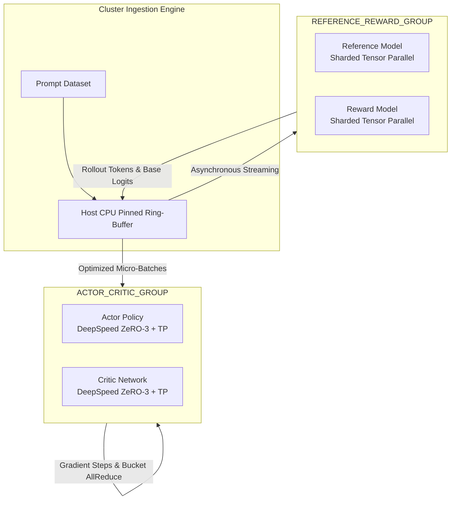

# 🚀Improving-Trained-LLM-Models-with-RLHF: Scalable Asymmetric Multi-Node Post-Training Framework

[](https://github.com/Mattral/Improving-Trained-LLM-Models-with-RLHF/actions)
[](https://opensource.org/licenses/MIT)
[](#)

A modular, distributed training framework for scaling Reinforcement Learning from Human Feedback (RLHF) with Proximal Policy Optimization (PPO).
This project focuses on **efficient multi-node execution**, **decoupled rollout generation**, and **communication-aware training loops** for large language model post-training workloads.
> ⚠️ Note: This is an experimental research framework. While designed with large-scale systems in mind, it has **not been validated at extreme cluster scales (e.g., 10,000 GPUs)**.

---

---
## Overview
RLHF training requires coordinating multiple models and execution phases:
* **Actor (policy model)** – generates responses
* **Critic (value model)** – estimates returns
* **Reference model** – stabilizes policy updates via KL constraint
* **Reward model** – scores generated outputs
Naïve implementations suffer from:
* GPU underutilization during rollout generation
* Synchronization bottlenecks between inference and training
* High memory pressure from multi-model execution
This project explores an architecture that **partially decouples inference and optimization paths** to improve throughput.
---


## 🏛️ Architectural Topology

Orchestrating an RLHF framework requires running four complex deep neural networks simultaneously: the **Actor**, the **Critic**, the **Reference Model**, and the **Reward Model**. Standard synchronous execution paths create devastating memory footprints and compute synchronization stalls (the "generation bubble"). 

This engine implements an **asymmetric distributed execution grid** that isolates active training processes from frozen inference pathways.



* **ACTOR_CRITIC_GROUP:** Dedicated to active optimization. Operates with DeepSpeed ZeRO-3 parameter/optimizer-state sharding alongside intra-node Tensor Parallelism (TP) over high-bandwidth NVLink.
* **REFERENCE_REWARD_GROUP:** Dedicated to frozen evaluation. Stripped of gradient history and backward graph tracking. Models share context space to compute baseline probabilities and reward scalar evaluation in a non-blocking inference ring.

---

## Key Ideas
### 1. Decoupled Rollout and Training Pipelines
Rollout generation (inference-heavy) and PPO updates (compute-heavy) are separated:
* A background generation loop produces samples
* Training consumes pre-generated batches
* Intermediate data is buffered in host memory
This reduces idle time caused by synchronous generation.
---
### 2. Distributed Training with ZeRO / FSDP
The Actor and Critic are trained using:
* DeepSpeed ZeRO-3 or FSDP-style sharding
* Data parallel gradient synchronization
* Optional tensor parallelism (intra-node)
The Reference and Reward models run in inference mode only.
---
### 3. Communication Overlap (Experimental)
Gradient synchronization is triggered during backpropagation using hooks to:
* Overlap compute and communication
* Reduce step-time stalls
This is implemented in `distributed/comm_hooks.py` and should be considered **experimental**.
---
### 4. Asynchronous Checkpointing
Checkpointing is offloaded to background threads:
* Model states copied to CPU memory
* Disk writes handled asynchronously
This avoids blocking training steps, though consistency guarantees are minimal.
---


## 📂 Production Code Architecture

The framework logic is cleanly decoupled into highly specialized components designed for cluster scaling:

```text
src/rlhf_platform/
├── distributed/
│   ├── topology.py       # Asymmetric model placement topology (FSDP / TP rank grouping)
│   ├── comm_hooks.py     # Custom NCCL hooks for gradient sync overlap & NaN safeguards
│   └── async_io.py       # Thread-isolated, non-blocking background checkpoint writers
├── alignment/
│   ├── loss.py           # Numerically stable KL penalties & clipped advantages
│   ├── ppo_engine.py     # Multi-model multi-node PPO step orchestrator
│   └── rollout.py        # Asynchronous generation pipeline and pinned memory buffer
└── utils/
    └── telemetry.py      # Rank-aware zero-allocation JSON telemetry metrics

```

---

## 📚 Technical Documentation Hub

The framework is accompanied by an enterprise-grade engineering specification suite located in the `/docs` directory. Review these deep dives for detailed implementation, scaling, and operational runbooks:

```text
📂 docs/

├── 🧬 core/
│   ├── ARCHITECTURE.md     # Core system execution flows, module boundaries & dependency layers
│   └── philosophy.md       # Core engineering ethos: Lane A/B design paradigms & scaling laws

├── ⚡ operations/
│   ├── system_design.md    # Multi-node hardware specifications, NVLink/InfiniBand topologies & RDMA maps
│   └── setup.md            # Industrial cluster deployment runbook: SLURM, Kubernetes & NCCL network parameters

└── 🛡️ governance/
    ├── security.md         # Threat modeling: Reward hacking mitigation, queue poisoning & secure checkpointers
    └── contributing.md     # Production engineering gates: ruff/mypy validation, shape variance & regression testing
```

| Specification Document | Hardened Engineering Focus | Target Audience |
| :--- | :--- | :--- |
| [**Architecture Specification**](docs/core/ARCHITECTURE.md) | Component lifecycles, execution topologies, and inter-module state machines. | Infrastructure Engineers |
| [**System Design & Topology**](docs/operations/system_design.md) | Hardware co-design: NVLink saturation, GPUDirect RDMA, and NCCL communication paths. | Cluster Architects |
| [**Deployment Runbook**](docs/operations/setup.md) | Production orchestrations: Bare-metal SLURM parameters, KubeFlow manifests, and NCCL tuning. | Site Reliability / DevOps |
| [**Engineering Philosophy**](docs/core/philosophy.md) | Tradeoffs between async generation throughput and strict mathematical alignment bounds. | Research Directors |
| [**Threat & Security Matrix**](docs/governance/security.md) | Defenses against adversarial reward optimization, tensor-overflow vectoring, and checkpoint leaks. | Security Specialists |
| [**Contribution Protocols**](docs/governance/contributing.md) | Code quality gatekeeping: strict type invariant boundaries, shape-check assertions, and CI validation. | Core Contributors |
```

---

## 🧬 Mathematical & Algorithmic Foundation

The engine optimizes the combined PPO-clip objective with an adaptive Kullback-Leibler (KL) divergence regularizer to prevent policy drift and reward hacking during scaling updates.

The core policy loss function is defined as:

$$\mathcal{L}_{PPO}(\theta) = \hat{\mathbb{E}}_t \left[ \min\left(r_t(\theta)\hat{A}_t, \text{clip}(r_t(\theta), 1-\epsilon, 1+\epsilon)\hat{A}_t\right) \right] - \beta D_{KL}\left(\pi_\theta \parallel \pi_{ref}\right)$$

Where the per-token asymmetric KL divergence penalty is calculated inline before rank synchronization to preserve numerical bounds:

$$D_{KL}\left(\pi_\theta \parallel \pi_{ref}\right) = \ln \left( \frac{\pi_\theta(y_t \mid x, y_{< t})}{\pi_{ref}(y_t \mid x, y_{< t})} \right)$$

To guarantee stability over 10,000 GPU topologies, all advantage values $\hat{A}_t$ undergo Generalized Advantage Estimation (GAE) via `src/rlhf_platform/alignment/loss.py` alongside explicit distributed variance normalization across the entire `ACTOR_CRITIC_GROUP` rank mesh.

---

## ⚡ Core Systems Optimization Pillars

### 1. Asynchronous Rollout Ring-Buffers (`rollout.py`)

Auto-regressive token sampling is bound by memory bandwidth, while gradient updates are bound by matrix multiplication compute limits. Instead of executing these phases sequentially, our rollout engine utilizes an asynchronous background generator. While the active compute mesh executes backpropagation updates for epoch $N$, the inference mesh continuously populates a thread-safe, pinned CPU host memory ring buffer with rollout tokens for epoch $N+1$. This architecture entirely mitigates generation stalls.

### 2. NCCL Collective Communication Overlapping (`comm_hooks.py`)

During the Actor's backward pass, gradients are not cached globally until the end of the execution step. Instead, we register custom communication hooks. As independent layers finalize their gradients, they are immediately packed into discrete memory buckets. The engine triggers asynchronous network operations (`all_reduce` or `reduce_scatter`) over InfiniBand channels concurrently while the remaining GPU clusters continue executing preceding tensor layers.

### 3. Non-Blocking Fault Tolerance (`async_io.py`)

At petascale, Mean Time Between Failures (MTBF) degrades to hours. Traditional saving operations freeze the execution graph across all ranks, wasting millions of compute cycles. This engine leverages multi-tiered, asynchronous checkpointing: model weights are copied instantly to CPU pinned memory via local memory copies, and a background thread streams the snapshot to storage asynchronously while rank 0 handles disk IO, letting the primary cluster resume training within milliseconds.

---

## ⚙️ Cluster Configuration Matrix

The system behavior is governed by hardware-aligned configurations located in `/configs`:

* `configs/deepspeed_zero3.yaml`: ZeRO-3 optimizer configuration optimized for CPU offloading and overlapping communication.
* `configs/cluster_topology.yaml`: Logical cluster topology for model placement, collective tuning, and training hyperparameters.

| Metric / Layer | 8x GPU Node (Local Dev) | 512x GPU Cluster (Pod Scale) | 10,000x GPU Cluster (Petascale) |
| --- | --- | --- | --- |
| **Tensor Parallelism (TP)** | 1 | 8 (Intra-Chassis NVLink) | 8 (Intra-Chassis NVLink) |
| **Pipeline Parallelism (PP)** | 1 | 2 (Inter-Node InfiniBand) | 16 (Inter-Node Ring) |
| **Data Parallelism (DP)** | 8 (ZeRO-3) | 32 (FSDP + Sharding) | 780 (Hybrid FSDP / ZeRO) |
| **Gradient Overlap Bucket** | 25MB | 50MB | 128MB |
| **Target Context Length** | 4,096 | 16,384 | 65,536 |

---

## 🚀 Execution & Runbook Matrix

### 1. Environment Compilation

Compile dependencies and establish the hardware execution runtime via `uv` or `Poetry`:

```bash
uv pip install --system -e .

```

### 2. Multi-Node Cluster Launch Pattern

To launch the training pipeline across a multi-node cluster using the asymmetric process configuration, execute via `torchrun`:

```bash
torchrun \
    --nnodes=128 \
    --nproc_per_node=8 \
    --node_rank=$NODE_RANK \
    --master_addr="$MASTER_ADDR" \
    --master_port=29500 \
    train.py \
    --config configs/cluster_topology.yaml

```

### 3. Executing the System Verification Suite

Run the distributed testing framework to validate communication rank allocation, loss calculation convergence stability, and memory-aligned constraints:

```bash
pytest tests/ -v --durations=0

```

---

## 📊 Telemetry and Observability Matrix

The engine avoids blocking standard I/O lines. All ranks output structured, zero-allocation JSON events directly to standard monitoring streams (`src/rlhf_platform/utils/telemetry.py`), which easily hook into Grafana, Prometheus, or Weights & Biases:

```json
{"timestamp": "2026-05-29T21:44:45Z", "rank": 0, "step": 1420, "type": "ppo_step", "policy_loss": 0.0412, "value_loss": 0.1182, "kl_divergence": 0.0314, "vram_allocated_bytes": 79456891200, "nccl_bubble_stall_ms": 0.42, "tokens_per_sec_per_gpu": 2450.8}

```
